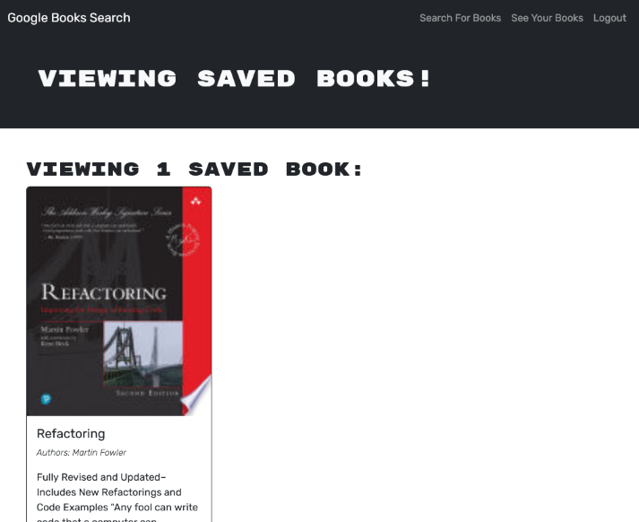

# Book Search (React/GraphQL)

## Description
This is a book search app that uses the [Google Books APIs](https://developers.google.com/books) to look up books on behalf of a user, and allows the saving and removing of favourites.  I built this as an exercise in using GraphQL (specifically [Apollo](https://www.apollographql.com/)).

## Installation
Running `npm install` will install all dependencies in both the server and client if run from the project root.  Running `npm run build` will build the client for production.  The app requires a MongoDB database, and for the `MONGODB_URI` to be set unless the database is co-located with the server (the default is `mongodb://127.0.0.1:27017/googlebooks`).  The environment variable will be picked up automatically if placed in a `.env` file in the server's root (see [dotenv](https://www.npmjs.com/package/dotenv) for more details).

## Usage
The user can log in or create a new account using the Login/Sign up button in the top right of the screen.  The main page has a search bar for entering book info, and a submit button to run the search.  If the user is logged in, search results will have a save button at the bottom of their info.  There is also a page for viewing saved books (the link is only visible if logged in), and each entry will have a button to remove it from the user's saved books.

[Try it live on Heroku](https://s2robertson-book-search-gql-e78910b9cd48.herokuapp.com/)

## Screenshots

## Credits
The original files were provided by University of Toronto Coding Bootcamp.  The original app was fully functional, but used a REST API, which I converted to GraphQL.

## License
MIT